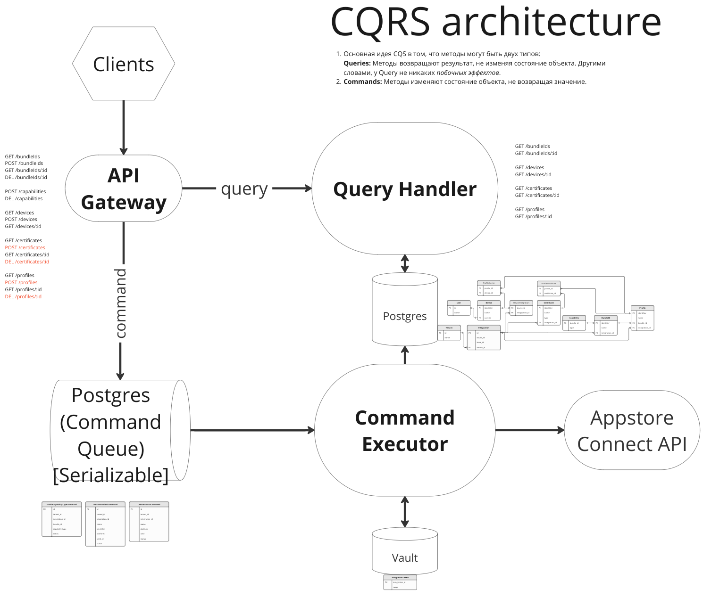
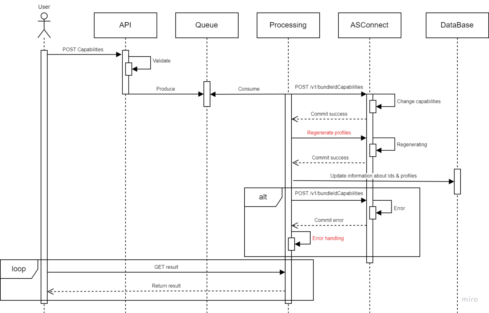
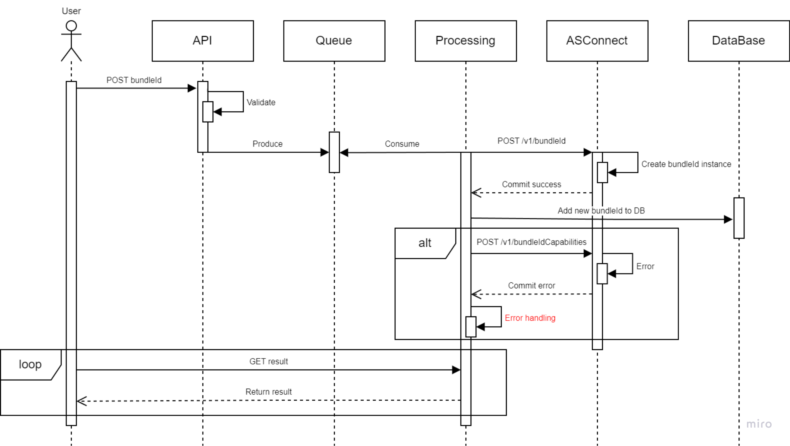

# Appstore Signer Project

**<a href="https://miro.com/app/board/uXjVN7ZCQww=/" target="_blank">Miro All Materials Link</a>**

## Architecture

### CQRS architecture
Основная идея CRQS в том, что методы могут быть двух типов:
Queries: Методы возвращают результат, не изменяя состояние объекта. Другими словами, у Query не никаких побочных эффектов.
Commands: Методы изменяют состояние объекта, не возвращая значение.

## Functional requirements

1. Как разработчик я хочу иметь возможность создать App ID 
2. Как разработчик я хочу иметь возможность редактировать App ID Capabilities 
3. Как разработчик я хочу иметь возможность локально подписать сборку личным (бесплатным) сертификатом разработчика 
4. Как разработчик я хочу иметь возможность локально подписать сборку платным сертификатом разработчика
5. Как разработчик я хочу иметь возможность подписать сборку прод сертификатом разработчика на CI (уровни доступа)
6. Как разработчик я хочу иметь возможность добавить тестовое устройство в аккаунт разработчика
7. Как инженер тех поддержки я хочу иметь возможность сбросить список устройств в аккаунте разработчика 
8. Как инженер тех поддержки я хочу иметь возможность сгенерировать сертификат для отправки пушей в аккаунте разработчика

## Sequence diagrams
### Change capabilities Sequence diagram

### Как разработчик я хочу иметь возможность создать Bundle ID

### Как разработчик я хочу иметь возможность добавить тестовое устройство в аккаунт разработчика

